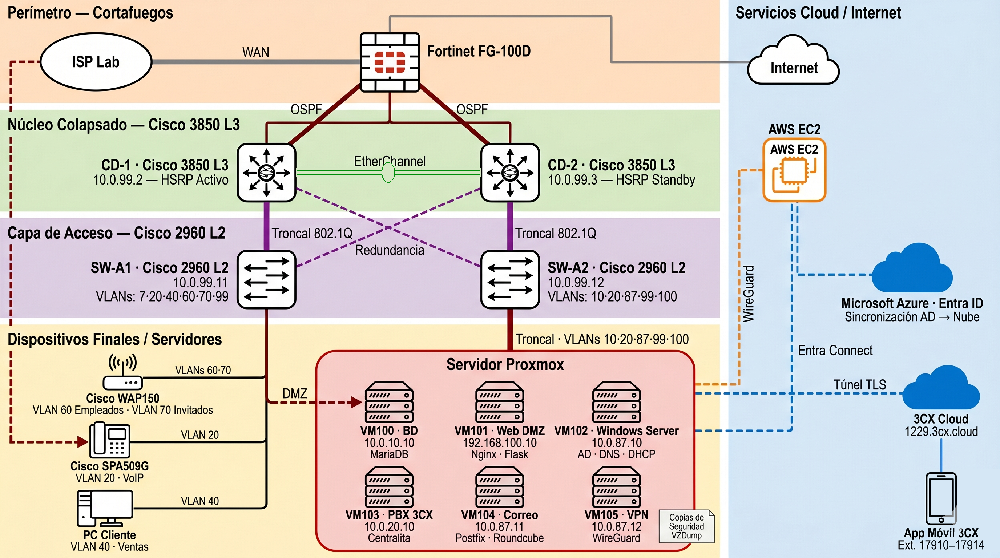

# Exotic Motors — Infraestructura Empresarial Completa


> Infraestructura de red empresarial completa desplegada sobre hardware físico Cisco y Fortinet,
> virtualización Proxmox, servicios Microsoft y exposición cloud en AWS.
> Proyecto final del ciclo formativo ASIR.

---

## Visión general



El proyecto simula la infraestructura real de un concesionario de vehículos de alta gama.
Desde el cableado físico hasta la capa cloud, todo está desplegado y operativo:
red segmentada en 10 VLANs con redundancia activa-pasiva, firewall perimetral FortiGate,
seis servicios en virtualización Proxmox, aplicación web propia en DMZ
y exposición pública en internet vía AWS EC2.

---

## Qué se implementó

| Área | Tecnología | Detalle |
|------|-----------|---------|
| **Switching L2/L3** | Cisco Catalyst 3850 + 2960 | Collapsed Core, VLANs 802.1Q, STP Rapid-PVST, VTPv3 |
| **Routing** | OSPF área 0 | FortiGate + 2 cores, convergencia dinámica, ECMP |
| **Redundancia** | HSRP | CD-1 activo, CD-2 standby con object tracking |
| **Firewall** | FortiGate FG-100D | 15 políticas, VIPs NAT, DMZ lógica 802.1Q, inspección SSL |
| **Virtualización** | Proxmox VE 9.1 | 6 VMs VLAN-aware sobre bridge 802.1Q |
| **Directorio activo** | Windows Server 2022 | AD DS, DHCP (5 scopes), DNS, GPOs departamentales |
| **Identidad cloud** | Microsoft Entra Connect | Sincronización AD local ↔ Azure, RBAC, grupos de seguridad |
| **Servidor de correo** | Postfix + Dovecot + Roundcube | LDAP auth contra AD, ClamAV + Rspamd milter, HTTPS webmail |
| **VoIP** | 3CX SBC v20 | 5 extensiones, grupo de timbrado, integración DHCP opción 150 |
| **Base de datos** | MariaDB | iptables restringido por IP origen, usuario dedicado por servicio |
| **Aplicación web** | Flask + Gunicorn + Nginx | Catálogo, reservas, panel admin, PDF, notificación SMTP |
| **VPN corporativa** | WireGuard (VM105) | Red 10.0.200.0/24, acceso remoto a toda la LAN interna |
| **Exposición internet** | AWS EC2 + WireGuard + Let's Encrypt | HTTPS público sin abrir puertos en el instituto |
| **WiFi** | Cisco WAP150 | 2 SSIDs (empleados/invitados) en VLANs separadas |

---

## Capa de red

### Diseño Collapsed Core

Dos switches Cisco Catalyst 3850 actúan simultáneamente como núcleo L3 y distribución,
eliminando la capa de distribución separada. Es la arquitectura estándar en empresas
medianas donde la alta disponibilidad importa pero el presupuesto es limitado.

```
FortiGate FG-100D (gateway + firewall)
       │ OSPF área 0 — enlace tránsito 172.16.150.0/29
  ┌────┴────┐
CD-1       CD-2          ← Cisco Catalyst 3850 × 2
HSRP       HSRP          ← Activo / Standby con object tracking
  │           │
SW-A1       SW-A2         ← Cisco Catalyst 2960 × 2
(usuarios)  (servidores)
```

### VLANs

| VLAN | Red | Propósito |
|------|-----|-----------|
| 7 | 10.0.7.0/24 | Marketing |
| 10 | 10.0.10.0/24 | Base de datos (aislada) |
| 20 | 10.0.20.0/24 | VoIP + DHCP opción 150 |
| 40 | 10.0.40.0/24 | Ventas |
| 60 | 10.0.60.0/24 | WiFi empleados |
| 70 | 10.0.70.0/24 | WiFi invitados (internet-only) |
| 87 | 10.0.87.0/24 | Servidores LAN |
| 99 | 10.0.99.0/24 | Gestión OOB |
| 100 | 192.168.100.0/24 | DMZ web |
| 150 | 172.16.150.0/29 | Enlace tránsito FortiGate↔Cores |

### Redundancia

- **HSRP:** CD-1 (prioridad 110, preempt) como activo. CD-2 (100) como standby.
  Object tracking sobre el uplink al FortiGate — si cae, CD-1 baja a prioridad 90
  y CD-2 toma el control automáticamente.
- **OSPF:** Ambos cores anuncian rutas a FortiGate. Si uno cae, el tráfico
  rerouta por el otro en convergencia de segundos.

---

## Seguridad y DMZ

### Diseño de defensa en capas

```
Internet
   │
   ▼
FortiGate FG-100D  ←  Primera línea: NAT entrante controlado por VIPs
   │
   ├── DMZ (VLAN 100)    ←  Subinterfaz 802.1Q — VM101 solo puede hablar
   │   VM101 Web             con BD (MySQL:3306) y Mail (SMTP:25)
   │      │                  El resto de la LAN está bloqueado por política
   │      ▼
   └── LAN interna       ←  OSPF distribuye rutas, FortiGate es el único
       10 VLANs              punto de salida a internet (NAT centralizado)
```

### Principios aplicados

- **Principio de mínimo privilegio:** cada VM solo puede acceder a los servicios
  que necesita. La webapp no puede hacer ping a un PC de marketing.
- **Segmentación estricta:** la VLAN de invitados WiFi solo tiene internet,
  sin acceso a ninguna red interna.
- **VPN sobre internet** en lugar de exponer puertos directamente.

---

## Servicios (VM por VM)

| VM | IP | OS | Servicios |
|----|----|----|-----------|
| VM100 | 10.0.10.10 | Debian 13 | MariaDB — BD aislada en VLAN propia |
| VM101 | 192.168.100.10 | Debian 13 | Flask + Nginx + Gunicorn + WireGuard (DMZ) |
| VM102 | 10.0.87.10 | Windows Server 2022 | Active Directory + DNS + DHCP + Entra Connect |
| VM103 | 10.0.20.10 | Debian 12 | 3CX SBC v20 — telefonía corporativa |
| VM104 | 10.0.87.11 | Ubuntu 24.04 | Postfix + Dovecot + Roundcube + ClamAV + Rspamd |
| VM105 | 10.0.87.12 | Debian 13 | WireGuard — VPN corporativa remota |

---

## Aplicación web

Aplicación Flask desarrollada a medida como sistema de gestión del concesionario.

```
Internet → EC2 AWS (HTTPS/Let's Encrypt) → WireGuard → VM101:80 → Nginx → Flask
Red interna → FortiGate VIP → VM101:443 → Nginx → Flask
                                                         │
                                              MariaDB (VLAN 10)
                                              Postfix (SMTP:25)
```

### Funcionalidades

- Catálogo público con 33 vehículos y filtros por marca y estado
- Simulador de leasing interactivo en la ficha de vehículo
- Registro y login de clientes con contraseñas bcrypt
- Sistema de reservas con flujo completo cliente → admin
- Panel de administración para empleados con asignación de visitas
- Notificación por email corporativo al asignar una visita
- Descarga de certificado PDF de reserva generado en tiempo real

### Stack

```
Flask 3.x  ·  Gunicorn (4 workers)  ·  Nginx  ·  MariaDB  ·  fpdf2  ·  werkzeug bcrypt
```

Ver código en [`webapp/`](webapp/).

---

## Cloud e identidad

### Exposición pública sin port forwarding

El instituto no permite redirección de puertos. La solución:
un servidor EC2 en AWS actúa como relay HTTPS, tunelizando el tráfico
a VM101 a través de WireGuard. El certificado Let's Encrypt vive en EC2.

```
exoticmotors.duckdns.org → EC2 35.169.27.141
    Nginx HTTPS (Let's Encrypt)
    └── proxy → http://10.8.0.2:80   ← HTTP dentro del túnel WireGuard
                      │
                   VM101 Nginx:80 → Gunicorn → Flask
```

### Microsoft Entra ID Connect

Los usuarios del Active Directory local se sincronizan con Azure Entra ID
(tenant `Exoticmotors2026gmail.onmicrosoft.com`) mediante Entra Connect v2.4.
Modo Password Hash Synchronization. RBAC configurado en Azure:
roles de directorio asignados por usuario (administrador de grupos, lector global, etc.).

---

## Documentación técnica

| Documento | Contenido |
|-----------|-----------|
| [Arquitectura de red](docs/arquitectura-red.md) | Collapsed Core, HSRP, OSPF, FortiGate, VLANs |
| [Servicios](docs/servicios.md) | AD, DHCP, DNS, correo, VoIP, BD |
| [Cloud y VPN](docs/cloud-vpn.md) | AWS EC2, WireGuard público e interno, Entra Connect |
| [Seguridad](docs/seguridad.md) | DMZ, políticas FortiGate, segmentación |
| [Problemas resueltos](docs/problemas-resueltos.md) | Incidencias reales encontradas y solucionadas |

---

## Equipo

Proyecto desarrollado por 4 estudiantes de ASIR en el Aula 27.

---

*Infraestructura verificada en funcionamiento el 21 de mayo de 2026, una semana antes de la presentación final.*
